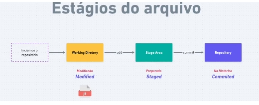

# Git

## Iniciar um novo repositório

- git init

## configurar o usuario e o email

- git config --global user.name "mazera3"
- git config --global user.email "mazera3@gmail.com"

## Verificar as configurações salvas

- git config --list

```
user.email=mazera3@gmail.com
user.name=Edio.Mazera
core.repositoryformatversion=0
core.filemode=true
core.bare=false
core.logallrefupdates=true
```

## Commit

- git add .
- git commit -m 'criado o arquivo index.html'

## Log (historico de commits)

- git log

```
commit ec004a50a95b7859c9343ddcf4b4db4a19ce5981 (HEAD -> master)
Author: Edio.Mazera <mazera3@gmail.com>
Date:   Sun May 15 22:40:07 2022 -0300

    criado o arquivo index.html
```

- git log --oneline
  `ec004a5 (HEAD -> master) criado o arquivo index.html`
- git log -n 3 (mosstra os ultimos 3 commits)

# Estagio de um arquivo



## Etapas
- iniciar o repositorio (git init) - diretorio de trabalho
- mover para area de staged - (git add) - preparar para repositorio
- registrar no repositorio (git commit)

- git status
```
No ramo master
nothing to commit, working tree clean
```
- Apos midific as o index.htm `git status`
```
No ramo master
Changes not staged for commit:
  (utilize "git add <arquivo>..." para atualizar o que será submetido)
  (use "git restore <file>..." to discard changes in working directory)
        modified:   index.html

nenhuma modificação adicionada à submissão (utilize "git add" e/ou "git commit -a")
```
